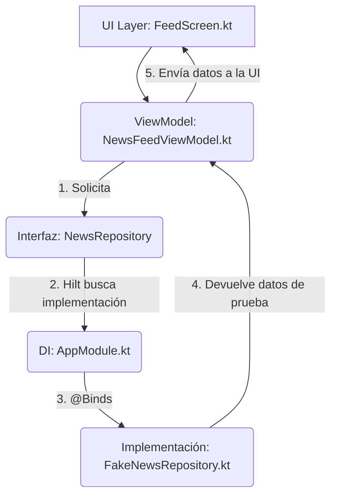

# UNSA Connect (Proyecto Académico)

**UNSA Connect** es una aplicación móvil nativa para Android, desarrollada como un proyecto académico. Su visión es servir como el canal de comunicación oficial, único y accesible para la comunidad universitaria de la UNSA (estudiantes, docentes y administrativos).

El objetivo principal de este MVP (Producto Mínimo Viable) es centralizar la información dispersa (noticias, eventos, becas y avisos) en una sola interfaz móvil, proactiva y fácil de usar, asegurando que la información crítica no se pierda.

-----

## 👨‍💻 Integrantes

  * `[Nombre Completo del Integrante 1]`
  * `[Nombre Completo del Integrante 2]`
  * `[Nombre Completo del Integrante 3]`

-----

## 🛠️ Stack Tecnológico

Este proyecto está construido 100% en **Kotlin** y sigue una arquitectura moderna de Android.

  * **UI:** [Jetpack Compose](https://developer.android.com/jetpack/compose) para una interfaz de usuario declarativa y moderna.
  * **Arquitectura:** Principios de [Clean Architecture](https://blog.cleancoder.com/uncle-bob/2012/08/13/the-clean-architecture.html) (separando capas de `data`, `domain` y `ui`).
  * **Inyección de Dependencias:** [Hilt](https://developer.android.com/training/dependency-injection/hilt-android) para gestionar las dependencias y desacoplar las capas.
  * **Asincronía:** Coroutines de Kotlin y Flow para manejar operaciones asíncronas y gestionar el estado.
  * **Diseño:** [Material 3](https://m3.material.io/), la última evolución del sistema de diseño de Google.
  * **Serialización:** `kotlinx.serialization` para el manejo de datos (usado en el backend simulado).

-----

## 🏛️ Arquitectura y Fuente de Datos de Prueba

Una parte clave de este proyecto es su arquitectura desacoplada, que nos permite cambiar fácilmente entre una fuente de datos de prueba (local) y una fuente de datos real (API remota) sin alterar la lógica de la UI.

La fuente de datos de prueba actual está implementada usando un patrón de Repositorio y habilitada mediante **Inyección de Dependencias (DI)** con Hilt.

El flujo es el siguiente:

### 1\. El Contrato (Capa de Dominio)

Se define una interfaz abstracta en la capa de dominio: `domain/repositories/NewsRepository.kt`.

Esta interfaz actúa como un "contrato" que le dice al resto de la app qué acciones se pueden realizar (ej. "obtener noticias recientes"), pero no *cómo* se obtienen.

```kotlin
// domain/repositories/NewsRepository.kt
interface NewsRepository {
    fun getHighlightedNews(): List<New>
    fun getRecentNews(): List<New>
    fun getCategories(): List<Category>
}
```

### 2\. La Implementación Falsa (Capa de Datos)

Se crea una clase concreta en la capa de datos: `data/repositories/FakeNewsRepository.kt`.

Esta clase implementa la interfaz `NewsRepository` y devuelve datos "quemados" (hardcoded). Esta es nuestra fuente de datos de prueba.

```kotlin
// data/repositories/FakeNewsRepository.kt
class FakeNewsRepository @Inject constructor() : NewsRepository {

    private val sampleCategories = listOf(...)
    private val sampleNews = listOf(...)

    override fun getRecentNews(): List<New> {
        return sampleNews // Devuelve la lista de prueba
    }
    // ...
}
```

### 3\. Habilitación con Hilt (Capa de Inyección de Dependencias)

Aquí ocurre la "magia". El módulo `di/AppModule.kt` le dice a Hilt cómo "atar" la interfaz a la implementación concreta.

Usando la anotación `@Binds`, le indicamos a Hilt que cada vez que una clase (como un ViewModel) pida una instancia de `NewsRepository`, Hilt debe proveerle una instancia de `FakeNewsRepository`.

```kotlin
// di/AppModule.kt
@Module
@InstallIn(SingletonComponent::class)
abstract class AppModule {

    @Binds
    @Singleton
    abstract fun bindNewsRepository(
        fakeNewsRepository: FakeNewsRepository // La implementación
    ): NewsRepository // La interfaz
}
```

### 4\. Consumo (Capa de UI)

Finalmente, el `NewsFeedViewModel` (que maneja la lógica de la pantalla del feed) simplemente solicita un `NewsRepository` en su constructor. No sabe ni le importa si los datos vienen de una base de datos local, de una API o de una lista falsa. Hilt se encarga de inyectar el `FakeNewsRepository` automáticamente.

```kotlin
// ui/viewmodels/NewsFeedViewModel.kt
@HiltViewModel
class NewsFeedViewModel @Inject constructor(
    private val newsRepository: NewsRepository // Hilt inyecta FakeNewsRepository aquí
) : ViewModel() {

    init {
        loadNews()
    }

    private fun loadNews() {
        // Llama a los métodos de la interfaz
        val recentNews = newsRepository.getRecentNews()
        // ...
    }
}
```

### Flujo de Datos de Prueba

El siguiente diagrama ilustra cómo la fuente de datos de prueba es habilitada y utilizada:



Esta arquitectura permite que, en el futuro, podamos reemplazar `FakeNewsRepository` por un `ApiNewsRepository` (que llame a una API real) simplemente cambiando el binding en `AppModule.kt`, sin modificar una sola línea de código en el `NewsFeedViewModel` o en la `FeedScreen`.

-----

## 🚀 Cómo Empezar

1.  **Clonar el repositorio:**
    ```bash
    git clone https://github.com/IntroNuevasPlataformas-2025/unsa-connect-android.git
    ```
2.  **Abrir en Android Studio:**
      * Abre Android Studio (versión recomendada: Hedgehog o posterior).
      * Selecciona `File` \> `Open` y elige la carpeta del proyecto.
3.  **Sincronizar Gradle:**
      * Deja que Android Studio descargue las dependencias (Hilt, Compose, etc.) y configure el proyecto.
4.  **Ejecutar la aplicación:**
      * Selecciona el dispositivo (emulador o físico).
      * Presiona `Run 'app'`.

La aplicación se ejecutará y mostrará inmediatamente los datos proveídos por `FakeNewsRepository.kt`.

-----

## 📄 Licencia

Este proyecto se distribuye bajo la Licencia MIT. Ver el archivo `LICENSE` para más detalles.
